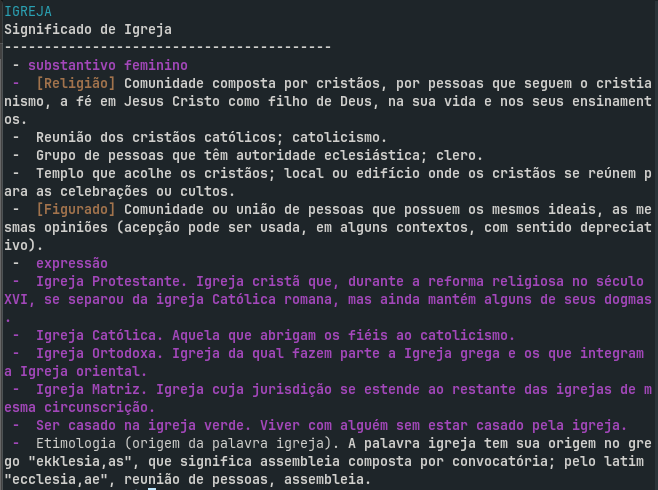

# dicio-cli
Um dicionário com interface de terminal

Este script faz um web scraping no site: https://www.dicio.com.br/ e formata o retorno em um agradável texto em terminal.

## Instalação
A instalação desse script pode ser feita por meio dos seguintes comandos:

```bash
git clone https://github.com/Jetrom17/dicio-cli.git && cd dicio-cli && sudo mv dicio-cli /usr/local/bin && cd .. && rm -rf dicio-cli && clear && echo 'Feito!'
```

Depois disso basta partir para o uso!

## Uso
O uso é bastante simples, basta digitar: `dicio-cli [PALAVRA]`, onde [PALAVRA] é a palavra que você quer pesquisar.

